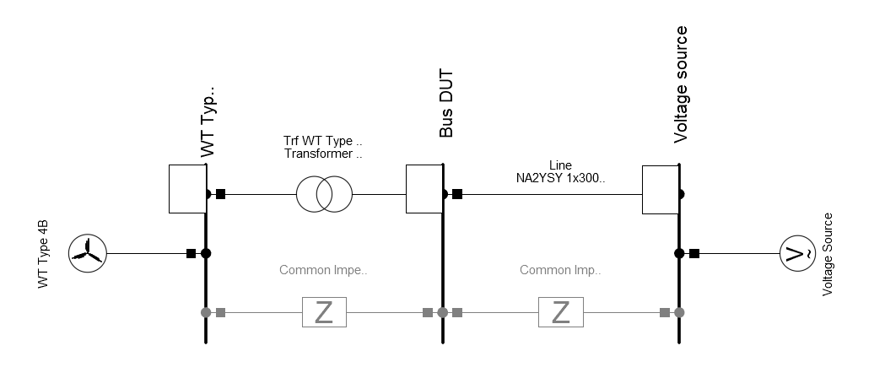

```{python}
#| echo: false
#| output: false
%load_ext autoreload
%autoreload 2
import matplotlib.pyplot as plt
plt.rcParams['axes.grid'] = True
```

This tutorial illustartes the dynamic simulation of a unit model (e.g. a wind turbine) for test scenarios with varying grid voltage behaviour at the point of connection. Such tests are required for example if you want to

- debug a dynamic model and its controllers
- validate a dynamic model 
    - from another software to *PowerFactory*: validate a model based on a reference (e.g. the same model implemented in a different software)
    - from *PowerFactory* to another software: create simulation results to validate the model implementation in another software 
- test the behaviour of a dynmic model for requirements, e.g. grid code requirements (**comming soon!**)

Arguably one of the most useful features in this tutorial is the `CompositeModel` interface of *powfacpy* which allows to monitor, plot and finally export all signals (input, output, internal, etc.) of dynamic models from a simulation.

```{python}
# If you use IPython/Jupyter:
import sys
import json

with open(r"..\..\settings_local.json") as settings_file:
    SETTINGS = json.load(settings_file)

sys.path.append(
    SETTINGS["local path to PowerFactory application"] # e.g. r"C:\Program Files\DIgSILENT\PowerFactory 2025 SP5\Python\3.13"
)
# Get the PF app
import powerfactory
app = powerfactory.GetApplication()
app.Show()
```

# Test System
The test system depicted in Fig. @fig-test_system_smib is used. It is a simple single-machine-infinite-bus system. The device under test (DUT), a type 4B wind turbine, is connected through a transformer to a $20$ kV cable with a controllable voltage source at the other end. You can also set the impedances into service as an alternative to the transformer (you then have to adapt the nominal voltages) and cable to simplify the system. Feel free to connect a different DUT and adapt the `DUT_COMPOSITE_MODEL_PATH` below.

You find the `component_test.pfd` project in the `.\pf_models` folder. Please add it to your *powfacpy* folder in the *PowerFactory* database. The next cell activates the project

{#fig-test_system_smib}

```{python}
DUT_COMPOSITE_MODEL_PATH = r"Network Model\Network Data\Grid\WECC WT Control System Type 4B"

app.ActivateProject(rf"{SETTINGS["path to powfacpy folder in PowerFactory database"]}\component_tests")
```

# Voltage Source Time Series
The voltage source angle, magnitude and frequency is controlled to test the response of the DUT. The next cell defines the time series of these signals. The [*trimes* package](https://fraunhiee-unikassel-powsysstability.github.io/trimes/docs/) is later used to create *pandas* DataFrames based on these definitions and these are read into the DSL objects controlling the voltage source. 

```{python}
voltage_source_signals = {
    "Angular jump": {
        "t [s]": [0, 5, 10, 15],
        "angle [rad]": [0, 0.5, -0.25, -0.25],
        "f [Hz]": [50],
        "mag [pu]": [1],
    },
    "Magnitude jump": {
        "t [s]": [0, 5, 10, 15],
        "angle [rad]": [0],
        "f [Hz]": [50],
        "mag [pu]": [1, 1.1, 0.9, 0.9],
    },
    "Frequency jump": {
        "t [s]": [0, 5, 10, 15],
        "angle [rad]": [0],
        "f [Hz]": [50, 51, 49, 49],
        "mag [pu]": [1],
    },
}
```

The next cell uses *trimes* functions to create and visualize DataFrames of time series data of the voltage source signals. Discrete steps of the signals are implemented as value changes between small time steps, e.g. between $(5-1E-6)$s and $5$s. 

```{python}
import matplotlib.pyplot as plt
from trimes.signal_generation import discretize, create_ts_from_dict_with_varying_length

dataframes_for_scenarios = {}
for scenario, voltage_settings in voltage_source_signals.items():
    df = create_ts_from_dict_with_varying_length(voltage_settings, time_label="t [s]") 
    df = discretize(df)  
    dataframes_for_scenarios[scenario] = df 
    # Display
    print(scenario)
    display(df)
    df.plot()
    plt.title(scenario)
```

This format is compliant with the `lapprox` function of DSL which is used in the voltage source controllers. The block defintion (`BlkDef`) uses the following code:

```
ref = lapprox(time(),array_linapprox)
```

The `array_linapprox` then appears in the dialogue of the DSL model:


We will see how to access and set these arrays later.

The next cell saves the voltage signal data to .csv and .json files if required. This can be helpful for example if you want to use the data in another simulation platform and implement the same tests.

```{python}
import os
import shutil

model_validation_dir = r".\\tests\tests_output\\dynamic_model_validation"
if os.path.exists(model_validation_dir):
    shutil.rmtree(model_validation_dir)
os.makedirs(model_validation_dir)

for scenario, df in dataframes_for_scenarios.items(): 
    scenario_folder = model_validation_dir + "\\" + scenario   
    os.makedirs(scenario_folder)    
    df.to_csv(scenario_folder + "\\" + "voltage_source.csv")
    with open(scenario_folder + "\\" +"voltage_source.json", "w") as outfile:
        json.dump(voltage_settings, outfile, indent=4, sort_keys=False)

```

# Create Study Cases
Next we create study case for the tests. First, we set up a base case which contains plots and where the result signals of the DUT, including all itscontrollers, are monitored.  
Let's clean the study case:

```{python}
from powfacpy.base.active_project import ActiveProjectCached
from powfacpy.applications.plots import Plots

try:
    app.Hide()
    act_prj = ActiveProjectCached(app)
    act_prj.activate_study_case(r"Study Cases\Base Case")
    pfplt = Plots(cached=True)
    pfplt.clear_all_graphics_pages()
    act_prj.clear_results_variables()
finally: 
    app.Show()
```

We want to display the grafic of the grafic of the test system network.

```{python}
from powfacpy.pf_classes.elm.net import Network

try:
    app.Hide()
    grid = Network(act_prj.get_unique_obj(r"Network Model\Network Data\Grid"))
    grid.show_grafic()
finally: 
    app.Show()
```

The *powfacpy* interface to the composite model class (`ElmComp`) provides convenient methods to monitor the signals of all slots (DSL models, static generators, etc.) and optionally create plots in *PowerFactory* for each slot. 

The method `monitor_signals_of_slots` adds result variables for all input and output signals. The method `monitor_signals_of_dsl_models` adds also internal variable and states of DSL models.

```{python}
from powfacpy.pf_classes.elm.comp import CompositeModel

try:
    app.Hide()
    comp = CompositeModel(act_prj.get_unique_obj(DUT_COMPOSITE_MODEL_PATH))
    comp.monitor_signals_of_slots(create_plots=True)
    comp.monitor_signals_of_dsl_models(create_plots=True)
finally: 
    app.Show()
```

Have a look at the pages shown in the study case to validate that the plots were created.

Let's do the same for the controlled voltage source:

```{python}
try:
    app.Hide()
    comp = CompositeModel(act_prj.get_unique_obj(r"Network Model\Network Data\Grid\Voltage source ctrl"))
    comp.monitor_signals_of_slots(create_plots=True)
finally: 
    app.Show()
```

The base study case is now ready. We use *powfacpy's* `StudyCases` interface to create study cases for each scenario (angle, frequency and magnitude jumps) and use the `Base Case` as a template: 

```{python}
from powfacpy.applications.study_cases import StudyCases

try:
    app.Hide()
    pfsc = StudyCases(app)
    pfsc.base_study_case = r"Study Cases\Base Case"
    pfsc.parameter_values = {
        "Scenario": list(dataframes_for_scenarios.keys())
        }
    pfsc.parameter_paths = {}
    pfsc.set_parent_folders_for_cases_scenarios_variations("Model validation")
    pfsc.add_scenario_to_each_case = False
    pfsc.add_variation_to_each_case = True
    pfsc.create_cases()
finally:
    app.Show()
```

# Dynamic Simulations
To run the dynamic simualtions, we need to set the arrays in the voltage source controllers. Let's assign the DSL models. The `DynamicSimulation` interface of *powfacpy* allows to access and set the DSL arrays.

```{python}
from powfacpy.applications.dynamic_simulation import DynamicSimulation

pfds = DynamicSimulation(app)

dsl_voltage_source_angle = act_prj.get_unique_obj(r"Network Model\Network Data\Grid\Voltage source ctrl\Angle")
dsl_voltage_source_magnitude = act_prj.get_unique_obj(r"Network Model\Network Data\Grid\Voltage source ctrl\Magnitude")
dsl_voltage_source_frequency = act_prj.get_unique_obj(r"Network Model\Network Data\Grid\Voltage source ctrl\Frequency")

pfds.get_dsl_obj_array(dsl_voltage_source_angle, size_included_in_array=False)
```

We iterate the study cases set the DSL arrays according to the *pandas* time series:

```{python}
try:
    app.Hide()
    for case_num, case_obj in enumerate(pfsc.study_cases):
        case_obj.Activate()
        scenario_name = pfsc.get_value_of_parameter_for_case("Scenario", case_num)
        df_vs = dataframes_for_scenarios[scenario_name]
        pfds.set_dsl_obj_array_from_pandas_series(dsl_voltage_source_angle, df_vs["angle [rad]"])
        pfds.set_dsl_obj_array_from_pandas_series(dsl_voltage_source_magnitude, df_vs["mag [pu]"])
        pfds.set_dsl_obj_array_from_pandas_series(dsl_voltage_source_frequency, df_vs["f [Hz]"])      
finally:
    app.Show()
```

Now we are ready to simulate! Results are saved to a .csv file.

```{python}
from powfacpy.applications.results import Results

try:
    app.Hide()
    pfri = Results(app)
    for case_num, case_obj in enumerate(pfsc.study_cases):
        case_obj.Activate()
        scenario_name = pfsc.get_value_of_parameter_for_case("Scenario", case_num)
        pfds.initialize_and_run_sim()
        df = pfri.export_to_pandas()
        df.to_csv(model_validation_dir + "\\" + scenario_name + "\\simulation_results.csv")
finally:
    app.Show()
```

# Requirements Testing
This section focuses on testing the DUT behaviour for time series requirements, e.g. according to grid code requirements. Take for example the reactive power requirements based on the voltage magnitude at the point of coupling. The DUT has to adapt its reactive power to voltage changes in a certain time frame and with a certain tolerance. 

We create an envelope for the feasible reactive power based on the voltage source signals.

Comming soon!

