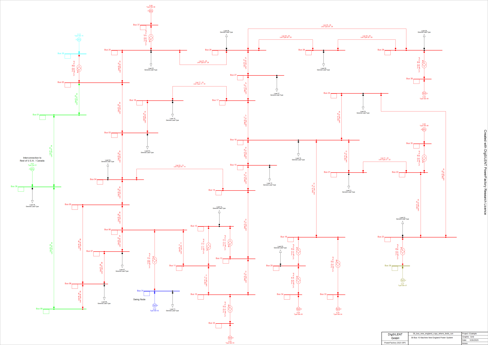
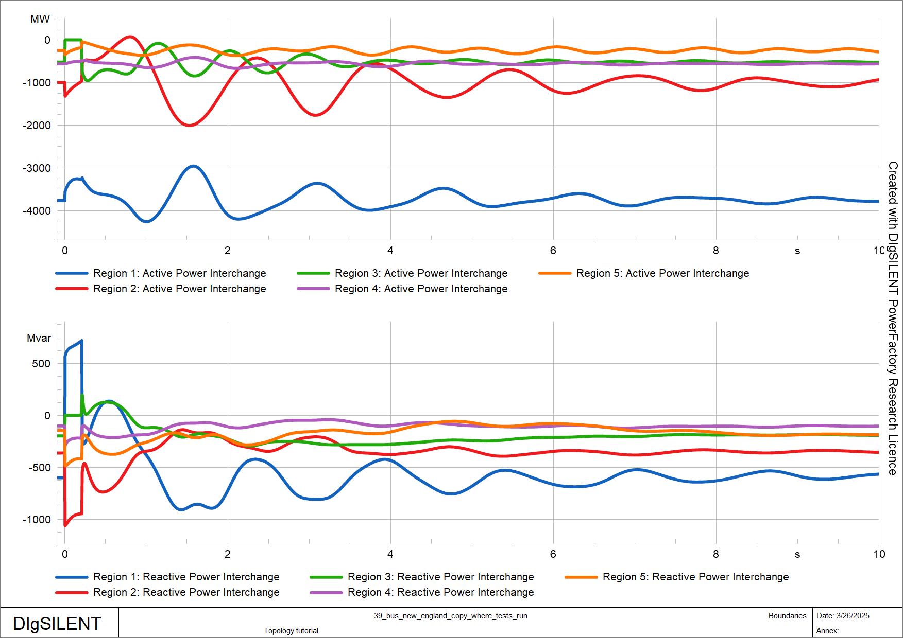
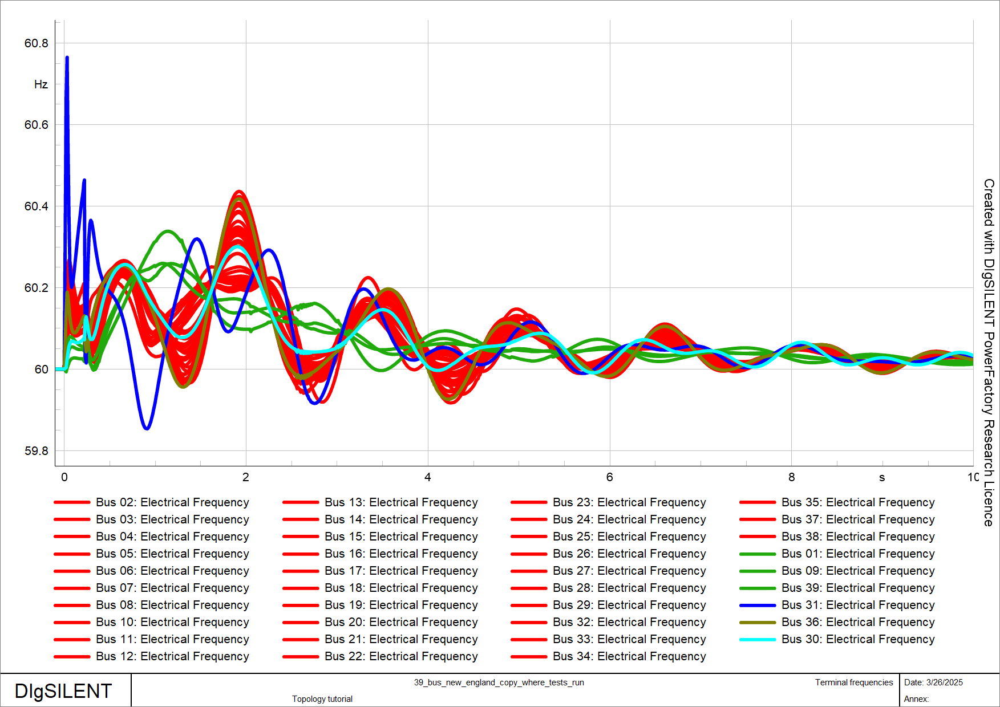

```{python}
#| echo: false
#| output: false
%load_ext autoreload
%autoreload 2

import matplotlib
matplotlib.rcParams.update({"axes.grid" : True}) # add grid by default
```

This tutorial focuses on network topologies, specifically the organization of network elements into boundaries, zones and areas. The main topics covered include:

- Creating and using boundaries
- Creating and using zones
- Creating and using areas
- Additional useful methods of *powfacpy* for groupings (boundaries, areas, zones), e.g. merging of zones/areas, showing areas in the network graphic, checking connectivity, checking if elements are internal, getting load flow results,  etc.
- Getting the dispatchable units of a grouping by technology (synchronous generators, PV, wind, battery storage) and setting or scaling their power dispatch and rated power

The respective *powfacpy* classes for zones/areas/boundaries extend the functionality of the PowerFactory classes. Note that *powfacpy* also defines its own grouping class named *SubSystem* with even more extended functionality which is covered in the [SubSystems tutorial](./subsystems.qmd). 

First, we activate the PowerFactory project of the *IEEE 39 bus system* example, create a copy of a stable study case and activate it.

```{python}
# If you use IPython/Jupyter:
import sys
import json

with open(r"..\..\settings_local.json") as settings_file:
    SETTINGS = json.load(settings_file)

sys.path.append(
    SETTINGS["local path to PowerFactory application"] # e.g. r"C:\Program Files\DIgSILENT\PowerFactory 2025 SP5\Python\3.13"
)
# Get the PF app
import powerfactory
app = powerfactory.GetApplication()
from powfacpy.base.active_project import ActiveProject
from powfacpy.pf_classes.protocols import PFApp

pf_app: PFApp = powerfactory.GetApplication()
act_prj = ActiveProject(pf_app)
act_prj.app.Show()
act_prj.app.ActivateProject(
    "powfacpy\\39_bus_new_england_copy_to_run_tests"
)  # You may change the project path.
study_case = act_prj.copy_single_obj("Study Cases\\2.3 Simulation Fault Bus 31 Stable", "Study Cases", new_name="Topology tutorial")
study_case.Activate()
act_prj.create_variation("Topology tutorial")
```

There are various classes to group network objects in *PowerFactory* including
- areas (ElmArea),
- zones (ElmZone),
- boundaries (ElmBoundary).

Areas and zones are very similar. One of their disadvantages is that it is not possible for one network element to be part of more than one area/zone. Boundaries on the other hand are more flexible and there is no such restriction, i.e. one element can be included in more than one boundary. Note also that the zone/area classes provide a method to define a boundary (`DefineBoundary`) that includes their internal elements. More information can be found in the *PowerFactory* manual in the chapter on *Grouping Objects*.

We will examine an example in which the terminals of the IEEE 39 bus system are categorized into several regions. Each terminal is assigned to a specific region. These regions have been preselected based on coherency identification, as referenced in @khalilDynamicCoherencyIdentification2016. The configuration includes one large region and several smaller regions, as detailed in the following list of elements.

```{python}
coherent_regions_terminals = [
    [
        "Bus 02",
        "Bus 03",
        "Bus 04",
        "Bus 05",
        "Bus 06",
        "Bus 07",
        "Bus 08",
        "Bus 10",
        "Bus 11",
        "Bus 12",
        "Bus 13",
        "Bus 14",
        "Bus 15",
        "Bus 16",
        "Bus 17",
        "Bus 18",
        "Bus 19",
        "Bus 20",
        "Bus 21",
        "Bus 22",
        "Bus 23",
        "Bus 24",
        "Bus 25",
        "Bus 26",
        "Bus 27",
        "Bus 28",
        "Bus 29",
        "Bus 32",
        "Bus 33",
        "Bus 34",
        "Bus 35",
        "Bus 37",
        "Bus 38",
    ],
    ["Bus 01", "Bus 09", "Bus 39"],
    ["Bus 31"],
    ["Bus 36"],
    ["Bus 30"],
]
```

# Boundaries
We will use the `Topology` class of *powfacpy* to create the regions. The lists with terminal names in `coherent_regions_terminals` assigned above are iterated and the method `create_boundary_using_intermediate_zone` is used, which creates a boundary by creating a zone in an intermediate step (first creating a zone is a convenient way to create a boundary). The method allows to exclude elements. In the example below, all loads (`ElmLod`) are excluded from the boundaries.

```{python}
from powfacpy.applications.topology import Topology
from powfacpy.pf_classes.elm.boundary import Boundary

try:
    app.Hide()
    act_prj.clear_folder(act_prj.boundaries_folder)
    topo = Topology()
    boundaries: list[Boundary] = []
    for n, terminals in enumerate(coherent_regions_terminals):
        terminal_objs = [act_prj.get_calc_relevant_obj(term + ".ElmTerm")[0] for term in terminals]
        boundary = topo.create_boundary_using_intermediate_zone(
            "Region " + str(n+1),
            terminal_objs,
            exclude_node_elms=lambda x: x.GetClassName() == "ElmLod",
            color=n+2,
        )
        boundaries.append(Boundary(boundary))
finally:
    app.Show()
```

::: {.callout-warning}
Note that the method `create_boundary_using_intermediate_zone` might change existing zones in the network model if their elements are included in the boundary (because elements can only be part of one zone). To avoid this use 'create_boundary_without_changing_initial_zones' instead.

:::

It is also possible to create boundaries by specifiying the terminals and branches of their borders (e.g. lines). We first create a dictionary where the keys are the terminals and the values are lists with the branch elements (actually we specify their path):

```{python}
bus_branch = {
    r"Network Model\Network Data\Grid\Bus 14": [
        r"Network Model\Network Data\Grid\Line 04 - 14",
        r"Network Model\Network Data\Grid\Line 13 - 14",
    ],
    r"Network Model\Network Data\Grid\Bus 16": [
        r"Network Model\Network Data\Grid\Line 16 - 17"
    ],
}
topo.create_boundary_from_bus_branch("Split West", bus_branch)
```

The objects of class `Boundary` are stored in the `boundaries` list in the loop above. The `Boundary` class of *powfacpy* offers some convenient methods, for example to visualize the interior of (all) boundaries in the single line diagram.

```{python}
from powfacpy.applications.plots import Plots
from os import getcwd

pf_plt = Plots(app)
pf_plt.set_active_graphics_page("Grid")
boundary_1 = boundaries[0]
boundary_1.show_boundary_interior_regions_in_network_graphic()
```

The regions are now illustrated in the single line diagram. Apparently, loads are excluded from the interior of the boundaries. 


We will now create plots showing the active and reactive power exchange of the boundaries as well as the frequencies of the terminals.

```{python}
from powfacpy.result_variables import ResVar

RMS_BAL = ResVar.RMS_Bal

try:
    app.Hide()
    pf_plt.clear_plot_pages()
    for n, boundary in enumerate(boundaries):
        pf_plt.set_active_plot("Active power", "Boundaries")
        pf_plt.plot(boundary.obj, 
                    boundary.get_P_exchange_res_var_rms_bal())
        pf_plt.set_active_plot("Reactive power", "Boundaries")
        pf_plt.plot(boundary.obj,  
                    boundary.get_Q_exchange_res_var_rms_bal())
        
        pf_plt.set_active_plot("Frequency", "Terminal frequencies")
        for term in coherent_regions_terminals[n]:
            terminal_obj = act_prj.get_calc_relevant_obj(term + ".ElmTerm")[0]
            pf_plt.plot(terminal_obj, RMS_BAL.ElmTerm.m_fehz.value, color=n+2)
finally:
    app.Show()            
```

Executing an RMS simulation gives the following results. As shown in the frequency plot, the frequencies at coherent terminals oscillate in phase. 

```{python}
from powfacpy.applications.dynamic_simulation import DynamicSimulation
pfds = DynamicSimulation(app)
pfds.initialize_and_run_sim(param_simulation={"tstop": 10})
```





# Zones
The topology class also allows to create zones. For example, a zone for the first region in `coherent_regions_terminals` can be created using terminals: :

```{python}
from powfacpy.pf_classes.elm.zone import Zone

try:
    app.Hide()
    terminal_objs_of_region_1 = [act_prj.get_calc_relevant_obj(term+".ElmTerm")[0] for term in coherent_regions_terminals[0]]
    zone_obj_1 = topo.create_zone("Region 1", terminal_objs_of_region_1)
finally:
    app.Show()
```

You can also create a zone based on a boundary:

```{python}
zone_obj_2 = boundaries[1].create_zone()
```

The `Zone` class of *powfacpy* can then be used to display zones in the single line diagram. 

```{python}
zone_1 = Zone(zone_obj_1)
zone_2 = Zone(zone_obj_2)
zone_1.show_zones_in_network_graphic()
```

# Areas
The `ElmArea` class of *PowerFactory* is very similar to the `ElmZone` class and so is the `Area` class of *powfacpy* compared to the `Zone` class.

```{python}
from powfacpy.pf_classes.elm.area import Area

area_obj = topo.create_area("Region 1", terminal_objs_of_region_1)
area_1 = Area(area_obj)
area_1.show_areas_in_network_graphic()
```

# Common Methods of Grouping Classes
Classes of *powfacpy* that group objects (like `Boundary`, `Zone` and `Area`) have common methods which are defined in the abstract base class `GroupingBase`. Here are some examples using the zone and boundary instances created above.

```{python}
try:
    app.Hide()
    
    # All internal elements
    elms = boundary_1.get_all_internal_elms()
    elms = zone_1.get_all_internal_elms()

    # Get internal elements with condition
    elms = boundary_1.get_internal_elms(condition=lambda x: x.GetClassName()=="ElmTerm" and x.uknom > 300)
    elms = zone_1.get_internal_elms(condition=lambda x: x.GetClassName()=="ElmTerm" and x.uknom > 300)
    
    # Get internal elements of class
    elms = boundary_1.get_internal_elms_of_class("ElmLne")
    elms = zone_1.get_internal_elms_of_class("ElmLne")
    
    # Check if element is internal
    is_internal = boundary_1.is_internal_elm(elms[0])
    is_internal = zone_1.is_internal_elm(elms[0])
    print(is_internal)
    
    # Check if list of elements (which must be of same class) are internal
    is_internal_list = boundary_1.are_internal_elms_with_same_class(elms)
    is_internal_list = zone_1.are_internal_elms_with_same_class(elms)
    print(is_internal_list)
    
    # Get results variable for active power exchange in RMS simulations
    p_res_var = boundary_1.get_P_exchange_res_var_rms_bal()
    p_res_var = zone_1.get_P_exchange_res_var_rms_bal()
    
    # Load flow state

finally:
    app.Show()
```

# Common Methods of Zones and Areas
`ElmZone` and `ElmArea` classes are very similar in their functionality in *PowerFactory*. Therefore, the `Zone` and `Area` classes of *powfacpy* also have some common methods which are defined in the abstract base class `ZoneAreaBase`. Here are some examples using the zone and area instances created above.

```{python}
try:
    app.Hide()

    # Load flow results must be present.
    act_prj.execute_load_flow()
    

    # load flow methods from AreaZoneBase
    print("Zone total load in MVA:", zone_1.load_flow_total_power_loads_in_MVA())
    print("Area total load in MVA:", area_1.load_flow_total_power_loads_in_MVA())
    print("Zone total generation in MVA:", zone_1.load_flow_total_power_generation_in_MVA())
    print("Area total generation in MVA:", area_1.load_flow_total_power_generation_in_MVA())
    
    # topology
    print("Are zones neighbors?", zone_1.is_neighbor(zone_2))
    print("All neighbors:", zone_1.get_neighbors())

finally:
    app.Show()
```

There is also a method to merge two zones/areas. The method takes care of the necessary changes in the network model, i.e. it changes the area/zone assignment of the terminals of the zone/area to merge and then deletes the merged zone/area. The method returns the merged ElmZone/ElmArea.

```{python}
try:
    app.Hide()
    zone_1.merge(zone_2)
finally:
    app.Show()
```

# Dispatchable Units in a Grouping

`GroupingBase` also gives quick access to the *dispatchable units* inside a grouping, sorted by technology. The category is taken from the PowerFactory plant-category *code* `aCategory` (e.g. `"wgen"`, `"pv"`, `"stor"`), which is stable across PowerFactory's display language - unlike the localised `cCategory` shown in the GUI (`"Wind"`, `"Photovoltaic"`, ...).

| method | returns |
|---|---|
| `get_internal_sg()` | synchronous generators (`ElmSym` with `i_mot == 0`) |
| `get_internal_pv()` | every `ElmPvsys` plus every `ElmGenstat` of category `"pv"` |
| `get_internal_wind()` | every `ElmGenstat` of category `"wgen"` |
| `get_internal_bess()` | every `ElmGenstat` of category `"stor"` with a battery sub-category |

The IEEE 39 bus system has only synchronous machines, so we use `zone_1` (still valid after the merge above) for those:

```{python}
print(len(zone_1.get_internal_sg()), "synchronous machines in zone 1")
```

## Unit groups

The properties `zone.sg`, `zone.pv`, `zone.wind` and `zone.bess` wrap the corresponding list in a `UnitCollection`. A `UnitCollection` still behaves like the list of raw PowerFactory objects (you can iterate and index it), but it adds aggregate operations. Its totals - and the `distribute` option below - account for parallel units (`ngnum`).

We do the following experiments in a separate variation so they can be rolled back out afterwards.

```{python}
from powfacpy.pf_classes.elm.unit_collection import UnitCollection

dispatch_variation = act_prj.create_variation("Dispatch examples")

machines: UnitCollection = zone_1.sg
print("count:                            ", len(machines))
print("total active power dispatch [MW]: ", round(machines.total_active_power))
print("total reactive power [Mvar]:      ", round(machines.total_reactive_power))
print("total rated apparent power [MVA]: ", round(machines.total_rated_power))
```

Set or scale the dispatch of the whole group:

```{python}
# the same setpoint on every unit
machines.set_power_dispatch(400, 50)                 # 400 MW, 50 Mvar each

# interpret the argument as a group total and split it equally
machines.set_power_dispatch(4000, distribute=True)

# scale the present dispatch (active and reactive, so the power factor is kept)
machines.scale_power_dispatch(0.9)

# re-dispatch to a group total, shared out proportionally to ...
machines.scale_to_total(4200, base="current")        # ... the present active power
machines.scale_to_total(4200, base="rated")          # ... the rated apparent power
print("total after re-dispatch [MW]:", round(machines.total_active_power))
```

By default the power-setting methods **widen the operational limits** (`Pmax_uc` / `Pmin_uc` and `cQ_min` / `cQ_max`) when a setpoint falls outside them; they never narrow a limit. Pass `adapt_limits=False` to leave the limits untouched. A reactive-power setpoint also switches the unit's input mode (`mode_inp`) to `"PQ"`, a power factor switches it to `"PC"`.

## Individual units

Each unit class - `SynchronousMachine` (`ElmSym`), `StaticGenerator` (`ElmGenstat`) and `PVSystem` (`ElmPvsys`) - has the same `set_power_dispatch` for a single element (`active_power` and `reactive_power` are per parallel unit here):

```{python}
from powfacpy.pf_classes.elm.sym import SynchronousMachine

machine = SynchronousMachine(zone_1.get_internal_sg()[0])
machine.set_power_dispatch(500)                                        # active power only
machine.set_power_dispatch(500, 120)                                   # ... and reactive power
machine.set_power_dispatch(500, power_factor=0.95, capacitive=True)    # ... or a power factor
print(machine.loc_name, "- rated apparent power [MVA]:", machine.rated_apparent_power)
```

## Rated power

`set_rated_power` / `scale_rated_power` change the units' nominal apparent power; pass `scale_setpoints=True` to move the dispatch with it.

::: {.callout-warning}
For `ElmSym` the rating lives on the shared machine *type* (`TypSym`). If a type is used by more than one machine, `set_rated_power` / `scale_rated_power` raise rather than silently re-rating the others - pass `copy_shared_type=True` to give each machine its own copy of the type first. The machines of the IEEE 39 bus system each have their own type, so it is not needed here.
:::

```{python}
machines.scale_rated_power(1.1, scale_setpoints=True)
print("total rated power now [MVA]:", round(machines.total_rated_power))

dispatch_variation.Deactivate()  # roll the experiments back out
```

## A grouping with converter-based units

The `39_bus_with_der` project from the [template models tutorial](./template_models.qmd) has wind (`ElmGenstat`) and PV (`ElmPvsys`) units. We switch to it and look at its pre-defined `Zone 2` (this is the last step of the tutorial, so we do not switch back).

```{python}
act_prj.app.ActivateProject("powfacpy\\39_bus_with_der_copy_to_run_tests")
act_prj.activate_study_case("Study Cases\\QDS")

der_zone = Zone(act_prj.get_calc_relevant_obj("Zone 2.ElmZone")[0])

print("synchronous generators:", len(der_zone.get_internal_sg()))
print("wind units (ElmGenstat):", len(der_zone.get_internal_wind()))
print("PV units (ElmPvsys):    ", len(der_zone.get_internal_pv()))
print("battery storage units:  ", der_zone.get_internal_bess())

print(f"installed wind capacity [MVA]: {der_zone.wind.total_rated_power:.0f}")
```

```{python}
der_variation = act_prj.create_variation("DER dispatch example")

# curtail the zone's wind to 60 % of its installed capacity
der_zone.wind.set_power_dispatch(0.6 * der_zone.wind.total_rated_power, distribute=True)
print("wind active power now [MW]:", round(der_zone.wind.total_active_power))

der_variation.Deactivate()
```

